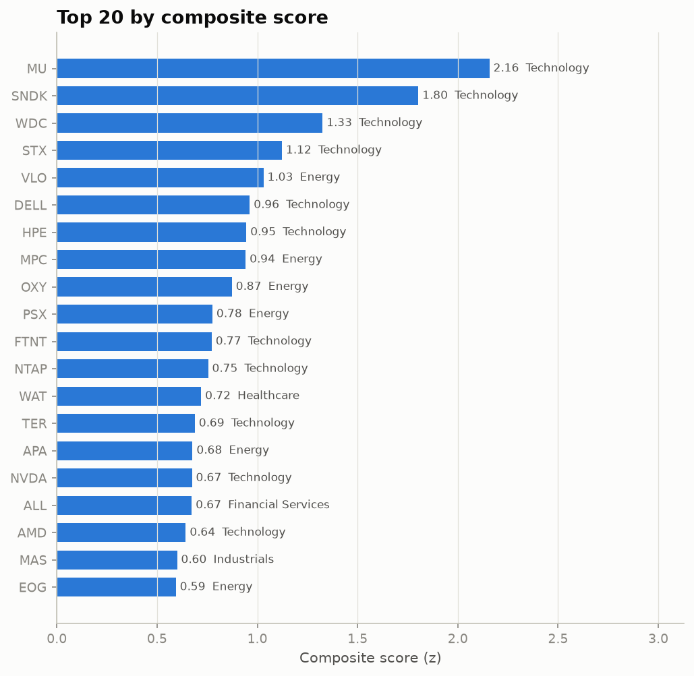
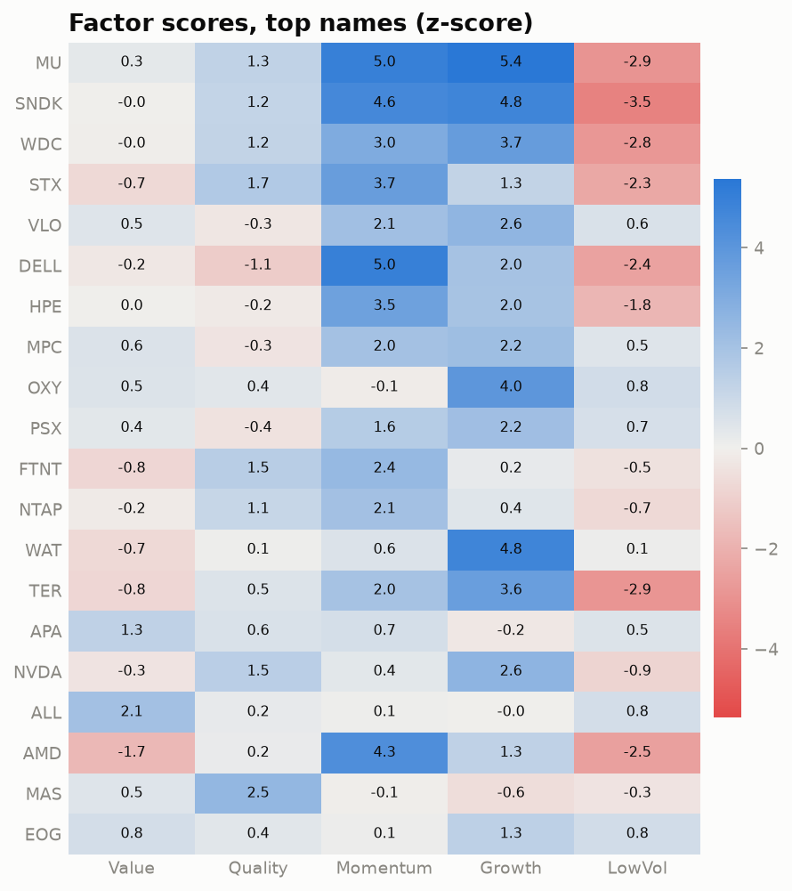
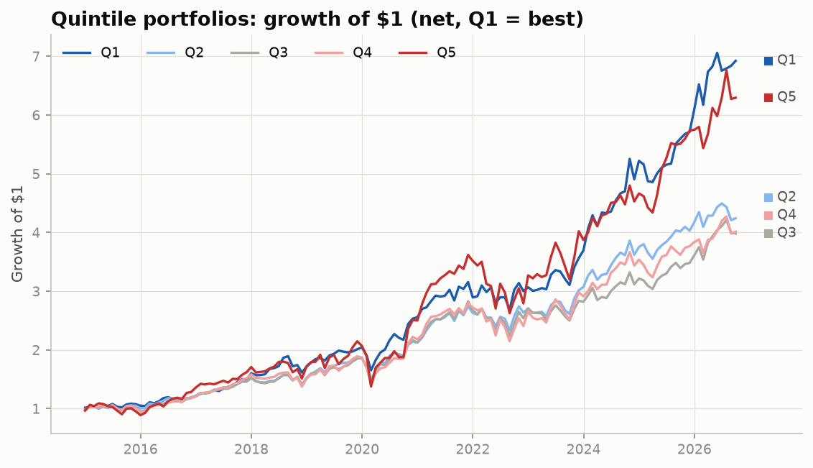
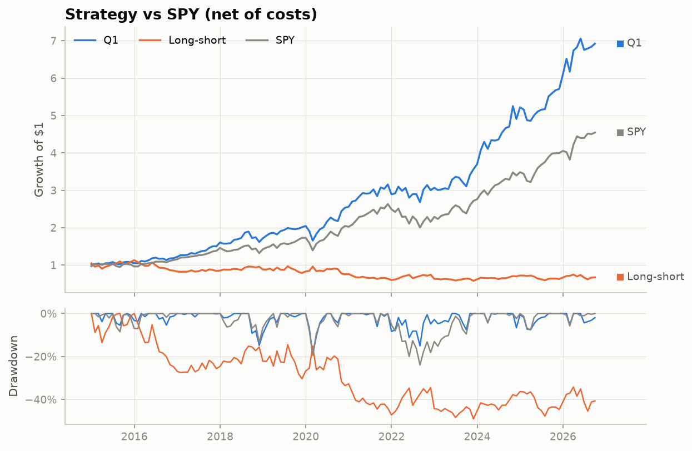
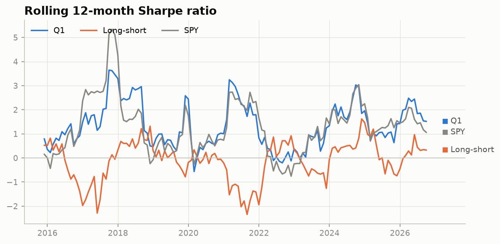
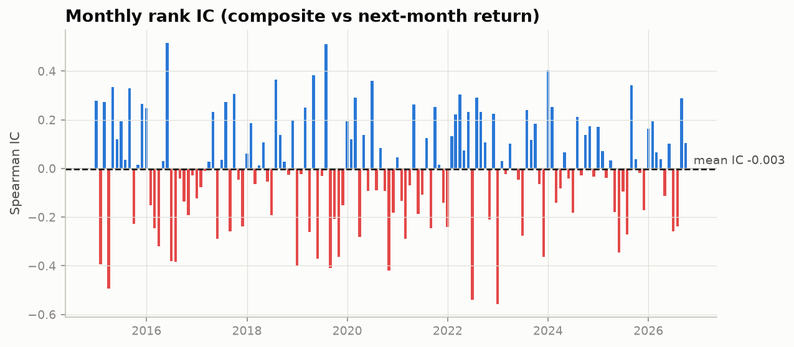
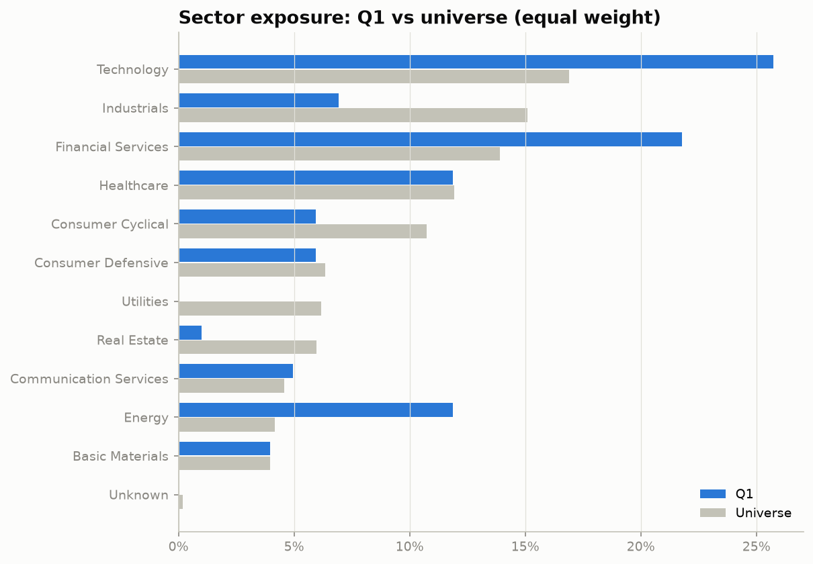

[](https://colab.research.google.com/github/FleximusRex/Finance-equity-scanner/blob/main/notebooks/multi_factor_equity_screener.ipynb)

# Multi-Factor Equity Screener

A Python research pipeline that ranks US large-cap stocks on five factor categories (value, quality, momentum, growth, low volatility) and tests the price-based factors with a monthly, point-in-time quintile backtest and rank-IC statistics.

## Executive summary

- **Current ranking:** every stock in the universe gets a composite score from 13 metrics in 5 categories (`outputs/sp500/rankings/rankings.csv`, 503 S&P 500 names).
- **Backtest:** 142 monthly rebalances (Dec 2014 – Sep 2026) using only the price factors (momentum, low vol), 10 bps per side transaction costs.
- **Main finding:** none of the price factors has a statistically significant rank IC at the 5% level. The momentum + low-vol composite has a mean IC of **−0.003 (t = −0.17, p = 0.87)** on the S&P 500, and its Q1–Q5 long-short spread lost **−3.3% CAGR** net of costs.
- **Strongest single signal:** beta and 60-day volatility, but with the *opposite* sign to the textbook low-vol anomaly: high-beta stocks beat low-beta stocks (IC −0.037, t = −1.59, p = 0.11 on the S&P 500; p = 0.06 on the 50-stock set). That is borderline, not significant.
- **Headline returns are not alpha:** the top quintile returned 17.8% CAGR vs. SPY's 13.6%, but an equal-weighted basket of the *same universe* returned 15.7%. Most of the gap vs. SPY comes from backtesting today's index members (survivorship bias), not from the factors.

## Research question

> Do simple, price-based equity factors (12-1 momentum, 6-month momentum, 60-day volatility, beta) predict the next month's cross-section of US large-cap stock returns, alone or combined, after transaction costs?

The test that answers this is the **rank information coefficient (IC)**: the Spearman correlation between each month's factor score and the next month's return, averaged over 142 months and t-tested against zero. Quintile and long-short returns are reported as a second view of the same question.

## Methodology

### Factors (higher score = better; inverted where lower is better)

| Category | Metrics | Source | In backtest? |
|---|---|---|---|
| Value | Earnings yield, FCF yield, EV/EBITDA (inverted) | yfinance fundamentals | No |
| Quality | ROE, gross margin, debt/equity (inverted) | yfinance fundamentals | No |
| Momentum | 12-1 month return, 6-month return | Prices | **Yes** |
| Low vol | 60-day volatility (inverted), 252-day beta vs SPY (inverted) | Prices | **Yes** |
| Growth | Revenue growth, earnings growth | yfinance fundamentals | No |

Price factors are computed at each rebalance date using only prices up to that date (`price_factors(..., asof=date)`; unit-tested for no look-ahead). Stocks with less than 252 days of history are excluded.

### Normalization and scoring

1. **Winsorize** each metric cross-sectionally at the 1st / 99th percentile.
2. **Z-score** each metric cross-sectionally and flip the sign for "lower is better" metrics.
3. **Category score** = mean of the available metric z-scores in that category.
4. **Composite** = weighted sum of category scores (value 25%, quality 25%, momentum 25%, growth 15%, low vol 10%). If a category is missing for a stock, the remaining weights are re-normalized.
5. **Quintiles:** Q1 = top 20% by composite, Q5 = bottom 20%.

### Backtest

- Monthly rebalance on the last trading day of the month, equal-weighted within each quintile.
- Composite = momentum (25%) + low vol (10%), re-normalized, because fundamentals are not point-in-time (see Limitations).
- Costs: 10 bps × traded notional, using one-way turnover measured against weights that drifted with returns. The long-short portfolio pays costs on both legs.
- Statistics: CAGR, volatility, Sharpe (rf = 0), max drawdown, beta/alpha vs SPY, information ratio, turnover, and rank IC with t-test.
- **Factor-by-factor test:** the same backtest is run separately on each single price factor and on the composite (`outputs/*/factor_tests.csv`).

## Data sources

| Data | Source | Cache |
|---|---|---|
| Adjusted daily close prices (2014 → latest) | Yahoo Finance via `yfinance` | `data/cache/prices_*.parquet` |
| Current fundamentals (`Ticker.info`) | Yahoo Finance via `yfinance` | `data/cache/fundamentals.parquet` |
| S&P 500 constituents | [Wikipedia: List of S&P 500 companies](https://en.wikipedia.org/wiki/List_of_S%26P_500_companies) | `data/cache/sp500_constituents.parquet` |

All downloads are cached as parquet and are never downloaded again once cached. A ticker with bad or missing data is logged and skipped, so it does not crash the run.

## Architecture

```
          config.py  (universe mode, dates, weights, costs)
               │
          universe.py ── test50 list │ S&P 500 (Wikipedia, cached)
               │
        data_loader.py ── yfinance ──► data/cache/*.parquet
          │                    │
     prices (daily)      fundamentals (current)
          │                    │
          └──── factors.py ────┘   raw metrics (point-in-time for prices)
                    │
               scoring.py          winsorize → z-score → categories → composite
               │        │
          rank.py    backtest.py   monthly quintiles, costs, IC, factor tests
               │        │          (uses performance.py for stats)
               ▼        ▼
          outputs/<universe>/  rankings.csv, backtest_*.csv, factor_tests.csv
                    │
          visualization.py / report.py ──► charts/*.png, single-stock report
```

## Charts

The charts below are from the S&P 500 run (`outputs/sp500/charts/`), matching the tables that follow. The same set for the 50-stock universe is in [`outputs/test50/charts/`](outputs/test50/charts/).

| | |
|---|---|
|  |  |
|  |  |
|  |  |
|  | |

## Backtest results: S&P 500 universe (price-factor composite, net of costs)

142 monthly rebalances, Dec 2014 – Sep 2026. Source: `outputs/sp500/backtest_summary.csv`.

| Portfolio | CAGR | Ann. vol | Sharpe | Max DD | Beta | Alpha | Info ratio | Avg turnover |
|---|---|---|---|---|---|---|---|---|
| Q1 (best) | 17.8% | 15.2% | 1.16 | −19.1% | 0.86 | 5.6% | 0.42 | 25.3% |
| Q2 | 13.0% | 13.9% | 0.95 | −19.6% | 0.84 | 1.5% | −0.11 | 47.4% |
| Q3 | 12.4% | 15.4% | 0.84 | −21.7% | 0.97 | −0.6% | −0.19 | 51.6% |
| Q4 | 12.5% | 17.3% | 0.77 | −25.5% | 1.06 | −1.5% | −0.09 | 45.4% |
| Q5 (worst) | 16.8% | 23.3% | 0.79 | −35.9% | 1.38 | −0.9% | 0.35 | 23.4% |
| Long-short Q1−Q5 (net) | −3.3% | 17.4% | −0.11 | −49.0% | −0.52 | 5.5% | −0.58 | 48.7% |
| Long-short Q1−Q5 (gross) | −2.2% | 17.4% | −0.04 | −44.0% | −0.52 | 6.6% | −0.53 | 48.7% |
| Equal-weight universe | 15.7% | 16.0% | 1.00 | −24.0% | 1.02 | 1.7% | 0.39 | 3.1% |
| SPY | 13.6% | 14.9% | 0.94 | −23.9% | 1.00 | 0.0% | — | — |

**How to read this.** Q1 has a better Sharpe ratio (1.16 vs 0.79) and a shallower drawdown than Q5, which is mostly what you would expect from a low-beta tilt. But returns are not monotonic across quintiles (Q5 > Q2–Q4), and the long-short spread is negative. Every quintile and the equal-weight basket benefit from survivorship bias, so beating SPY is not evidence of skill. The equal-weight basket (15.7%) is the fair baseline for Q1 (17.8%).

## Factor-by-factor IC tests

Each price factor is backtested alone (signed so that a higher score is expected to be better), along with the composite. IC = mean monthly Spearman rank IC; CAGRs are net of costs. Sources: `outputs/sp500/factor_tests.csv`, `outputs/test50/factor_tests.csv`.

**S&P 500 (503 tickers)**

| Signal | IC mean | IC t-stat | p-value | Q1 CAGR | Q5 CAGR | L/S CAGR |
|---|---|---|---|---|---|---|
| 12-1 momentum | 0.004 | 0.26 | 0.80 | 20.1% | 15.5% | 0.5% |
| 6-month momentum | 0.005 | 0.33 | 0.75 | 20.0% | 15.4% | 0.5% |
| 60-day vol (inverted) | −0.029 | −1.49 | 0.14 | 10.5% | 26.7% | −17.5% |
| Beta (inverted) | −0.037 | −1.59 | 0.11 | 10.1% | 25.1% | −17.0% |
| Composite (mom + low vol) | −0.003 | −0.17 | 0.87 | 17.8% | 16.8% | −3.3% |

**50-stock test universe**

| Signal | IC mean | IC t-stat | p-value | Q1 CAGR | Q5 CAGR | L/S CAGR |
|---|---|---|---|---|---|---|
| 12-1 momentum | 0.014 | 0.63 | 0.53 | 24.4% | 19.3% | 0.3% |
| 6-month momentum | 0.029 | 1.34 | 0.18 | 23.2% | 14.7% | 3.5% |
| 60-day vol (inverted) | −0.045 | −1.85 | 0.067 | 10.2% | 27.6% | −18.4% |
| Beta (inverted) | −0.054 | −1.87 | 0.063 | 11.6% | 28.9% | −18.7% |
| Composite (mom + low vol) | 0.003 | 0.14 | 0.89 | 20.1% | 16.8% | −1.6% |

**What the IC tests show**

1. **No factor is significant at 5%** in either universe.
2. **Momentum is essentially flat.** Q1 beats Q5 by about 5 points of CAGR, but the IC is near zero (p ≈ 0.75–0.80 on the S&P 500), so the spread comes from a few months or names rather than a consistent ranking.
3. **Low vol has the wrong sign.** High-vol and high-beta stocks outperformed (L/S ≈ −17% CAGR). That fits a 2015–2026 bull market led by high-beta tech. It is also inflated by survivorship: volatile stocks that are in today's index are, by construction, the ones that went up.
4. **The composite cancels out.** Momentum (slightly positive) and inverted low vol (negative) offset each other, leaving an IC of about zero.
5. **The effects shrink with more stocks.** Every |t-stat| is smaller on the S&P 500 than on the 50-stock set, so the 50-stock results are noisier and partly driven by a few mega-caps.

## 50-stock vs S&P 500 comparison

| Metric (price-factor composite) | 50-stock | S&P 500 |
|---|---|---|
| Universe size | 50 | 503 |
| Q1 CAGR (net) | 20.1% | 17.8% |
| Q5 CAGR (net) | 16.8% | 16.8% |
| Equal-weight universe CAGR | 18.0% | 15.7% |
| SPY CAGR | 13.6% | 13.6% |
| Q1 Sharpe | 1.18 | 1.16 |
| Q1 − EW CAGR | +2.1 pts | +2.1 pts |
| Long-short CAGR (net) | −1.6% | −3.3% |
| Composite IC mean (t, p) | 0.003 (0.14, 0.89) | −0.003 (−0.17, 0.87) |
| Best single-factor |t| | beta, 1.87 (p = 0.063) | beta, 1.59 (p = 0.11) |

The 50 hand-picked mega-caps have the most survivorship bias: their equal-weight basket beat SPY by 4.4 points a year with no factor model at all. Widening to the full S&P 500 brings that down to 2.1 points and weakens every factor signal. The conclusions hold in both universes: there is no significant predictive power, and low vol had the wrong sign over this period.

## Limitations

- **Fundamentals are not point-in-time.** yfinance only provides *current* fundamentals, so value, quality and growth cannot be backtested without look-ahead. They are used only in the current ranking, and the historical test covers momentum and low vol only.
- **Survivorship bias.** Both universes are *today's* tickers projected back to 2014. Firms that were delisted, acquired or dropped from the index are missing, which inflates absolute returns (especially for high-vol names). Compare quintiles with each other and with the equal-weight basket, not with SPY.
- **yfinance reliability.** Yahoo Finance is an unofficial, rate-limited source. Fields can be missing, revised or wrong (e.g. debt/equity units, negative equity), and adjusted prices can change between downloads. Tickers that fail are skipped and logged.
- **No short-borrow costs.** The long-short portfolio pays 10 bps trading costs on both legs but ignores borrow fees, short rebates, margin and hard-to-borrow constraints.
- **Simplified execution.** Trades happen at month-end close with equal weights. There is no market impact, capacity, sector or beta neutralization, or risk model.
- **Statistical caveats.** 142 monthly observations, overlapping factor definitions, and several factors tested at once (no multiple-testing correction) mean a borderline p-value such as 0.06 should be read as "no evidence", not "almost significant".

## Installation

```bash
git clone https://github.com/FleximusRex/Finance-equity-scanner.git
cd Finance-equity-scanner
python -m venv .venv && source .venv/bin/activate   # Python 3.11
pip install -r requirements.txt
```

Or click **Open in Colab** at the top to run the notebook without installing anything.

## Usage

```bash
# Universe: "sp500" (default) or "test50"; set in src/config.py or per run with an env var
python -m src.rank             # current 5-category ranking -> outputs/sp500/rankings/rankings.csv
python -m src.backtest         # backtest + factor tests  -> outputs/sp500/{backtest_*,factor_tests}.csv
python -m src.visualization    # charts                  -> outputs/sp500/charts/
python -c "from src.report import stock_report; stock_report('AAPL')"  # single-stock report
python -m src.dashboard      # Equity Factor Lab web app -> docs/index.html (reads outputs/, no downloads)

UNIVERSE_MODE=test50 python -m src.backtest   # same pipeline on the 50-stock test set
pytest -q                                      # unit tests (scoring, no look-ahead)
```

The first run downloads and caches data. Later runs read from `data/cache/`.

**Interactive app:** `docs/index.html` is a single self-contained page (all data embedded). Open it locally or serve it with GitHub Pages (Settings → Pages → `main` / `docs`). It has Basic and Advanced modes, rankings, stock lookup, a 3D factor-space view, the backtest and the factor tests.

## Repository structure

```
Finance-equity-scanner/
├── src/
│   ├── config.py          # dates, universe mode, weights, costs, paths
│   ├── universe.py        # test50 list / S&P 500 from Wikipedia (cached)
│   ├── data_loader.py     # cached yfinance prices + fundamentals, retries, skip-on-error
│   ├── factors.py         # raw price (point-in-time) and fundamental metrics
│   ├── scoring.py         # winsorize, z-score, category + composite scores
│   ├── rank.py            # current ranking
│   ├── backtest.py        # monthly quintile backtest, costs, factor-by-factor tests
│   ├── performance.py     # CAGR, Sharpe, drawdown, alpha/beta, rank IC, t-tests
│   ├── visualization.py   # matplotlib charts
│   ├── report.py          # single-stock report
│   ├── dashboard.py       # builds docs/index.html from outputs/ CSVs
│   └── dashboard_template.html  # app UI (HTML/CSS/JS, inline-SVG charts, three.js 3D view)
├── tests/test_scoring.py
├── notebooks/multi_factor_equity_screener.ipynb
├── outputs/
│   ├── sp500/             # S&P 500 results (rankings, backtest, factor tests, charts)
│   └── test50/            # 50-stock results, kept for comparison
├── data/cache/            # parquet cache (git-ignored)
├── requirements.txt
└── LICENSE
```

## Future upgrades

- Point-in-time fundamentals (e.g. Compustat / SEC EDGAR XBRL with filing-date lags) to backtest value, quality and growth properly.
- Survivorship-free historical constituents (index membership by date, including delisted returns).
- Sector- and beta-neutral portfolios, plus a regression of returns on Fama-French factors to separate real alpha from known exposures.
- Multiple-testing corrections (e.g. Bonferroni / Harvey-Liu-Zhu t > 3 hurdle) and bootstrap confidence intervals for IC.
- Short-borrow costs, market-impact model and capacity analysis.
- Rolling-window factor weights and IC decay across 1/3/6/12-month horizons.

## Disclaimer

This project is for educational and research purposes only and is not investment advice. Backtested results are hypothetical, affected by the biases described above, and do not indicate future performance. No result here is a guarantee of any return.

## License

[MIT](LICENSE)
